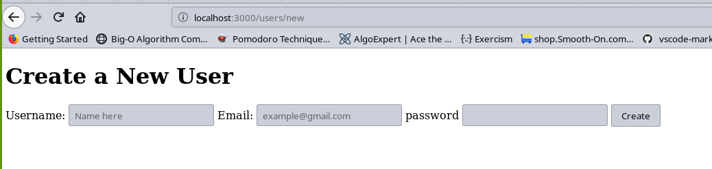

<!-- PROJECT LOGO -->
# PROJECT:FORMS
This Project is a Rails app built using Ruby on Rails, to implement the creation of forms both using nearly-pure HTML and then graduating to using the helper methods that Rails provides.

<!-- TABLE OF CONTENTS -->
## Table of Contents
- [PROJECT:FORMS](#projectforms)
  - [Table of Contents](#table-of-contents)
- [About The Project](#about-the-project)
- [Getting started](#getting-started)
  - [Installation](#installation)
  - [Features:](#features)
- [Authors](#authors)
- [Acknowledgements](#acknowledgements)
  - [Show your support](#show-your-support)
<!-- ABOUT THE PROJECT -->
# About The Project
This Project is a Rails app built using Ruby on Rails, to implement the creation of forms both using nearly-pure HTML and then graduating to using the helper methods that Rails provides. We have created a User Controller that contains the new, create, edit and update methods, along with its routes and corresponding forms inside the Views.

<!-- GETTING STARTED -->
# Getting started
## Installation
* Clone the repo following [this link](https://github.com/aracelicaes/re-former)
* Install all dependencies running from terminal using the command <pre><code>bundle install
</code></pre>
* Run from terminal <pre><code>bin/rails console
</code></pre>

## Features:
* Ruby 2.7.0
* Rubocop
* Ruby Gems
* Postgresql

<!-- CONTACT -->
# Authors
👤 **Ara Camarillo**

- Github: [aracelicaes](https://github.com/jessicafarias)
- Twitter: [@Ara_CE_93](https://twitter.com/Ara_CE_93)
- Linkedin: [Ara Camarillo](www.linkedin.com/in/ara-camarillo)

👤 **Jessica Farias**

- Github: [jessicafarias](https://github.com/jessicafarias)
- Twitter: [@FariasRosado](https://twitter.com/FariasRosado)
- Linkedin: [jessica-michelle-farias-rosado](https://www.linkedin.com/in/jessica-michelle-farias-rosado/)

* Project Link: [Click Here](https://github.com/aracelicaes/re-former)
<!-- ACKNOWLEDGEMENTS -->
# Acknowledgements
- [Microverse](https://microverse.org)
- [Best-README-Template](https://github.com/othneildrew/Best-README-Template)
- [Rails Guides](https://guides.rubyonrails.org/)
- [The Odin Project](https://www.theodinproject.com/courses/ruby-on-rails/lessons/forms)

## Show your support

Give a ⭐️ if you like this project!
